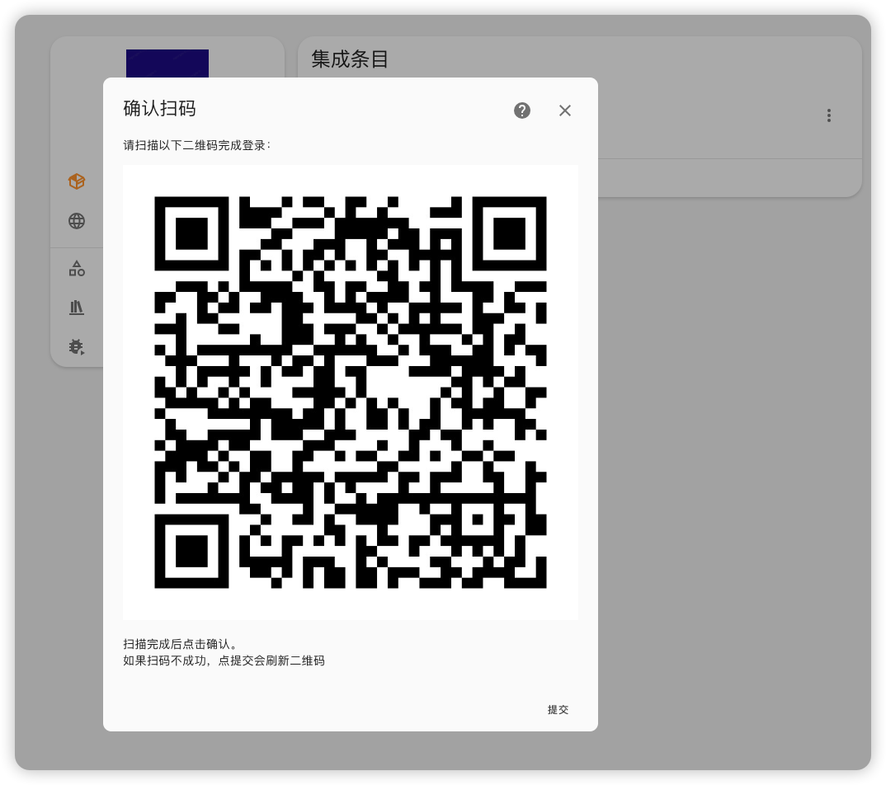
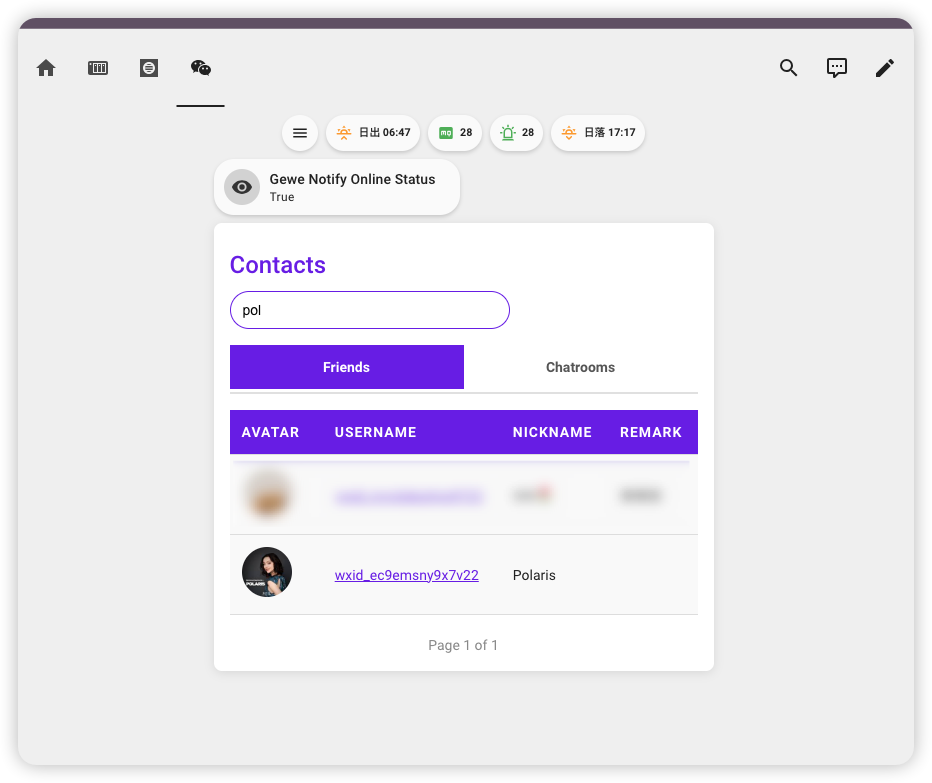
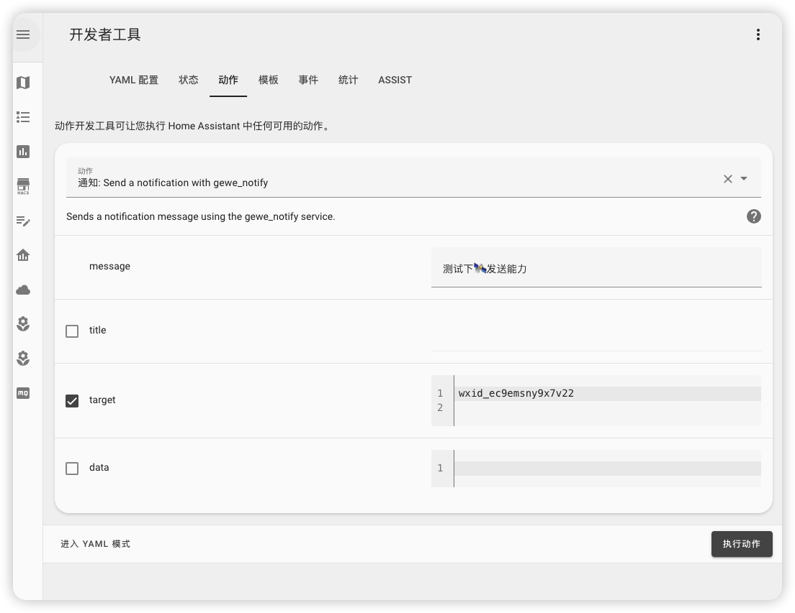

# Gewe-Notify

Gewe-Notify 是一个基于 Home Assistant HACS 的插件，允许用户通过 **Home Assistant** 系统调用 **Gewechat** 后端 API 的发送微信。

## 功能特点

- 支持通过 Home Assistant 发送微信
- 支持 **Action --> Notify** 动作
- 支持 **微信在线状态实体**,可用于自动化检测微信是否在线
- 轻量、易于安装和配置
- 适用于使用 **Home Assistant** 和 **Gewechat** 的用户

## 安装

### 先决条件

- 确保你已安装 [Home Assistant](https://www.home-assistant.io/) 并已配置好 HACS（Home Assistant Community Store）。
- 本插件依赖 **Gewechat** 后端 API，请参阅 [Gewechat 部署文档](https://github.com/Devo919/Gewechat) 进行配置。
- **Gewechat** 是通过模拟一台iPad设备, 而微信只支持一台iPad登录,所以....

### 插图

1. 添加集成或重新配置时支持扫码登录

2. 搭配卡片使用搜索userName(wxid)

3. 调用 notify 发送微信

# TL;DR

### 安装插件

1. 打开 Home Assistant 系统并进入 HACS。
2. 搜索 **Gewe-Notify** 插件，并点击 **安装**。
3. 安装完成后，重启 Home Assistant 系统。

### 配置 Gewechat 后端

Gewe-Notify 插件需要配合 **Gewechat** 后端 API 使用。请按照以下步骤部署和配置 **Gewechat** 后端：

1. 根据 [Gewechat 配置指南](https://github.com/Devo919/Gewechat) 完成后端部署。

## 使用方法

1. 在 Home Assistant 中，进入插件设置页面，找到 **Gewe-Notify** 插件。
2. 配置 Gewechat API 的地址。
3. 首次运行请执行 **Action --> gewe.fetch_contacts**, 可搭配`https://github.com/netcookies/gewe-notify-card`卡片查找target值
4. 在 Action 中找到**notify.gewe_notify**填入target, 默认消息类型是文本(text), message是必填字段, 但仅在文本类型时有效, 其他类型时请随意填写, 不为空就行, 支持的消息类型见下表。

### 支持的消息类型及所需参数

| 消息类型   | 所需参数                                                      | 描述                                                                                           |
|------------|---------------------------------------------------------------|------------------------------------------------------------------------------------------------|
| `text`     | `message`，`ats`（可选）                                       | 发送文本消息。`ats` 是一个可选参数，用于提及用户。                                                |
| `file`     | `file_url`，`file_name`                                        | 发送文件消息。                                                                                 |
| `image`    | `img_url`                                                     | 发送图片消息。                                                                                 |
| `voice`    | `voice_url`，`voice_duration`                                  | 发送语音消息。`voice_duration` 是语音消息的时长，单位为秒。                                       |
| `video`    | `video_url`，`video_duration`，`thumb_url`                     | 发送视频消息。`video_duration` 是视频的时长，`thumb_url` 是视频的缩略图 URL。                     |
| `link`     | `link_url`，`title`，`desc`，`thumb_url`                       | 发送链接消息。`title` 是链接的标题，`desc` 是描述，`thumb_url` 是缩略图 URL。                      |

## 贡献指南

欢迎大家为 **Gewe-Notify** 插件贡献代码！如果你希望参与开发，请遵循以下步骤：

1. Fork 本仓库。
2. 创建一个新的分支（`git checkout -b feature-branch`）。
3. 提交你的修改（`git commit -am 'Add new feature'`）。
4. 将更改推送到你的分支（`git push origin feature-branch`）。
5. 创建一个 Pull Request。

## 许可证

本项目使用 **MIT 许可证** - 详细信息请参见 [LICENSE](LICENSE) 文件。

## 感谢

- [Devo919/Gewechat](https://github.com/Devo919/Gewechat) 提供了后端 API。
- 感谢所有为 Gewe-Notify 和 Gewechat 项目做出贡献的开发者。

## 联系方式

如果你有任何问题或建议，欢迎提出 issue 或联系项目维护者。

---

### 说明

1. **项目描述**：介绍 **Gewe-Notify** 插件的功能，并指出它与 **Gewechat** 后端 API 的依赖关系。
2. **安装方法**：提供插件的安装方法以及 Gewechat 后端 API 的部署指南。
3. **使用方法**：详细说明如何配置和使用插件。
4. **配置**：介绍插件的配置项以及需要设置的 Gewechat API 信息。
5. **贡献指南**：如何为插件贡献代码。
6. **感谢**：特别感谢 **Gewechat** 提供的后端 API。
